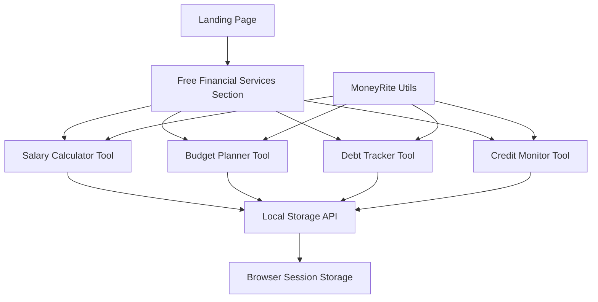

# Design Document

## Overview

This design integrates MoneyRite financial tools directly into the JobRite landing page as free, publicly accessible services. The integration will add a dedicated "Free Financial Services" section between the existing job categories and remote jobs sections, providing four core financial tools without requiring user authentication. All data will be stored locally in the browser to ensure privacy and immediate functionality.

## Architecture

### High-Level Architecture



### Data Flow Architecture

1. **Client-Side Only**: All calculations and data storage happen in the browser
2. **No Authentication**: Tools are immediately accessible without login
3. **Local Storage**: Data persists during browser session only
4. **Privacy First**: No server-side data transmission for financial information

## Components and Interfaces

### 1. Free Financial Services Section

**Location**: Between job categories and remote jobs sections on landing page

**Structure**:
```html
<section class="free-financial-services py-16 lg:py-24 bg-gradient-to-br from-primary-color to-primary-dark">
  <div class="max-w-7xl mx-auto px-4 sm:px-6 lg:px-8">
    <!-- Section Header -->
    <div class="text-center mb-16">
      <div class="free-services-badge">
        <span class="badge-text">100% FREE</span>
        <span class="badge-subtext">No Registration Required</span>
      </div>
      <h2 class="section-title">Financial Planning Tools</h2>
      <p class="section-description">Take control of your finances with our professional-grade tools</p>
    </div>
    
    <!-- Tools Grid -->
    <div class="tools-grid">
      <!-- Individual tool cards -->
    </div>
  </div>
</section>
```

### 2. Tool Card Component

**Design Pattern**: Consistent card-based interface for each tool

**Features**:
- Tool icon and name
- Brief description
- "Try Now - Free" button
- Privacy notice
- Usage statistics (optional)

### 3. Modal/Overlay System

**Purpose**: Display tools in overlay without leaving landing page

**Components**:
- Modal backdrop
- Tool interface container
- Close/minimize controls
- Data privacy notice
- Local storage indicator

### 4. Individual Tool Interfaces

#### A. Salary Calculator Interface

**Input Fields**:
- Pay amount (number input)
- Pay period (dropdown: hourly, daily, weekly, monthly, annually)
- Hours per week (number input, conditional)
- Medical aid checkbox
- Medical aid members (number input, conditional)
- Pension percentage (number input)

**Output Display**:
- Gross monthly/annual salary
- Income tax breakdown
- UIF contributions
- Medical aid tax credits
- Pension contributions
- Net take-home pay
- Conversion table (hourly, daily, weekly, monthly, annual rates)

**Real-time Calculation**: Updates as user types

#### B. Budget Planner Interface

**Input Sections**:
- Monthly income
- Expense categories (South African focused):
  - Housing (Rent/Bond)
  - Groceries & Household
  - Utilities (Water/Electricity)
  - Transport (Fuel/Taxi)
  - Education (School Fees)
  - Healthcare/Medical
  - Insurance
  - Loan Repayments
  - Family Support (Black Tax)
  - Entertainment & Lifestyle
  - Savings & Investments
  - Other Expenses

**Output Display**:
- Total expenses
- Remaining balance
- Budget health indicator
- Visual pie chart of spending
- Recommendations for overspending

#### C. Debt Tracker Interface

**Input Fields**:
- Debt name
- Debt type (dropdown)
- Current balance
- Annual interest rate
- Monthly payment
- Original amount (optional)

**Output Display**:
- Monthly interest amount
- Principal payment portion
- Payoff timeline
- Total interest to be paid
- Debt-free date
- Payment schedule preview

**Multiple Debts**: Support for tracking multiple debts with prioritization

#### D. Credit Monitor Interface

**Educational Focus**: Since actual credit scores require authentication

**Features**:
- Credit score education
- Factors affecting credit scores
- Credit improvement tips
- Debt-to-income ratio calculator
- Credit utilization calculator
- Payment history importance
- Credit mix guidance

## Data Models

### Local Storage Schema

```javascript
// Salary Calculator Data
const salaryData = {
  payAmount: number,
  payPeriod: string,
  hoursPerWeek: number,
  includeMedical: boolean,
  medicalMembers: number,
  pensionPercentage: number,
  lastCalculated: timestamp,
  results: {
    grossMonthly: number,
    grossAnnual: number,
    incomeTax: number,
    uif: number,
    medicalCredit: number,
    pensionContribution: number,
    netMonthly: number
  }
};

// Budget Planner Data
const budgetData = {
  monthlyIncome: number,
  expenses: {
    housing: number,
    groceries: number,
    utilities: number,
    transport: number,
    education: number,
    healthcare: number,
    insurance: number,
    loans: number,
    familySupport: number,
    entertainment: number,
    savings: number,
    other: number
  },
  lastUpdated: timestamp,
  budgetName: string
};

// Debt Tracker Data
const debtData = {
  debts: [
    {
      id: string,
      name: string,
      type: string,
      currentBalance: number,
      interestRate: number,
      monthlyPayment: number,
      originalAmount: number,
      createdDate: timestamp
    }
  ],
  lastUpdated: timestamp
};

// Credit Monitor Data
const creditData = {
  educationalProgress: {
    completedSections: array,
    lastAccessed: timestamp
  },
  calculatorResults: {
    debtToIncomeRatio: number,
    creditUtilization: number,
    lastCalculated: timestamp
  }
};
```

## Error Handling

### Input Validation
- Real-time validation with user-friendly error messages
- Prevent invalid data entry
- Clear validation state indicators

### Calculation Errors
- Graceful handling of mathematical edge cases
- Fallback values for extreme inputs
- Error recovery suggestions

### Storage Errors
- Handle localStorage quota exceeded
- Provide manual data export options
- Clear error messaging for storage issues

### Browser Compatibility
- Feature detection for localStorage
- Fallback to sessionStorage if needed
- Progressive enhancement approach

## Testing Strategy

### Unit Testing
- Individual calculation functions
- Data validation logic
- Local storage operations
- Error handling scenarios

### Integration Testing
- Tool interactions with landing page
- Modal system functionality
- Data persistence across sessions
- Cross-browser compatibility

### User Experience Testing
- Mobile responsiveness
- Touch interaction optimization
- Accessibility compliance
- Performance on slower devices

### Privacy Testing
- Verify no data transmission to servers
- Confirm local-only storage
- Test data clearing functionality
- Validate privacy notices

## Security Considerations

### Data Privacy
- All financial data remains client-side
- No server transmission of sensitive information
- Clear data retention policies
- User-controlled data deletion

### Input Sanitization
- Prevent XSS through input validation
- Sanitize all user inputs
- Validate numerical ranges
- Escape output display

### Browser Security
- Use secure localStorage practices
- Implement CSP headers
- Validate all client-side calculations
- Prevent data leakage between sessions

## Performance Optimization

### Loading Strategy
- Lazy load tool interfaces
- Progressive enhancement
- Minimal initial bundle size
- Efficient calculation algorithms

### Caching Strategy
- Cache calculation results
- Optimize re-calculations
- Efficient DOM updates
- Minimize reflows/repaints

### Mobile Optimization
- Touch-friendly interfaces
- Optimized for slower connections
- Reduced memory usage
- Battery-efficient calculations

## Accessibility Features

### WCAG 2.1 Compliance
- Keyboard navigation support
- Screen reader compatibility
- High contrast mode support
- Focus management in modals

### Inclusive Design
- Clear, simple language
- Multiple input methods
- Error prevention and recovery
- Consistent interaction patterns

### Responsive Design
- Mobile-first approach
- Flexible layouts
- Readable typography
- Touch target optimization

## Integration Points

### Landing Page Integration
- Seamless visual integration with existing design
- Consistent branding and styling
- Smooth scrolling and navigation
- Performance impact minimization

### Existing MoneyRite Code Reuse
- Leverage existing calculation utilities
- Reuse form validation logic
- Adapt existing UI components
- Maintain calculation accuracy

### Analytics Integration
- Track tool usage (anonymously)
- Monitor user engagement
- Measure conversion impact
- Performance monitoring

## Visual Design System

### Color Scheme
- Primary: Navy blue (#233D4D) - existing brand color
- Secondary: Light lavender (#F3EFF5) - existing secondary
- Accent: Orange (#FE7F2D) - existing accent
- Success: Green (#10B981) - for positive results
- Warning: Yellow (#F59E0B) - for alerts
- Error: Red (#EF4444) - for errors

### Typography
- Primary font: Work Sans (existing)
- Headings: Bold weights for hierarchy
- Body text: Regular weight for readability
- Numbers: Tabular figures for alignment

### Spacing and Layout
- Consistent with existing design system
- 8px grid system
- Generous whitespace
- Clear visual hierarchy

### Interactive Elements
- Consistent button styles
- Hover and focus states
- Loading indicators
- Success/error feedback

## Technical Implementation Notes

### Framework Integration
- Pure JavaScript for calculations
- CSS Grid/Flexbox for layouts
- Existing Django template integration
- Progressive enhancement approach

### Browser Support
- Modern browsers (ES6+)
- Graceful degradation for older browsers
- Feature detection for localStorage
- Polyfills where necessary

### Code Organization
- Modular JavaScript architecture
- Separate files for each tool
- Shared utility functions
- Clean separation of concerns